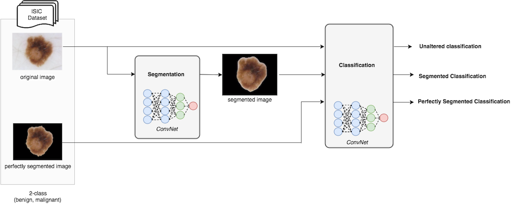

# Skin lesion detection from dermoscopic images using Convolutional Neural Networks
Early Melonama Detetction

## Skin Cancer |Early Melonama Detetction | Skin lesion detection 

Some facts about skin cancer:
 - Every year there are **more new cases of skin cancer** than the **combined incidence of cancers of the prostate, lung, breast and colon**. Roughly 87,110 new cases of invasive melanoma has been diagnosed in the U.S. per year.
 
 - **Early Melonama detection is critical!**  
	- The estimated 5-year survival rate for patients whose melanoma is detected early is about 98 percent in the U.S. 
	- The survival rate falls to 62 percent when the disease reaches the lymph nodes, and 
	- The survival rate falls to 18 percent when the disease metastasizes to distant organs.

## Abstract (Multiple Solution Approach)

The recent emergence of machine learning and deep learning methods for medical image analysis has enabled the development 
of intelligent medical imaging-based diagnosis systems that can assist physicians in making better decisions about a 
patient’s health. In particular, skin imaging is a field where these new methods can be applied with a high rate of success.

**Taxonomy/ Keywords** : `Medical Image Analysis`, `Deep Learning`, `Medical Decision Support Systems`,  
`U-Net Convolutional Neural Networks`, `Transfer Learning`,`VGG-Net Convolutional Neural Networks`, `Melanoma`, `Dermoscopy`, `Skin Lesions`, `Skin Cancer`, `CoreML`, `TensorflowLite`, `MaskRCNN`.

### "Fine-Tuned Smart" Solution Approach Abstraction:-->
"Fine-tuned Smart Solution approach" focuses on solving the problem of automatic skin lesion detection, particularly on melanoma detection, by "
**semantic segmentation** and followed by  **classification (powered by Transfer Learning)**" from **dermoscopic images (from ISIC)** using a deep learning based approach. 
 - For the 1st part of the solution approach (semantic segmentation for an **accurate extraction of the lesion region**) -
  ** U-Net convolutional neural network architecture** is applied. 
 - For the 2nd part of the solution approach (Classification /binary classification of **"Benign versus Malignant Cancer"** for early melanoma detection) - 
     - The proposed solution is built around the **VGG-Net ConvNet architecture** and 
	 - uses the **Transfer learning paradigm** (to deal with the general challenge of**Minimal Ground Truth** by avoid groud up training of Detection Model.).

	 

P.S.  
	- *This solution approach performs way better, optimized and offers better result. The experimental results of the segmentation evaluations demonstrate that the proposed method can outperform other state-of-the-art models.   
	- It very effectively deals with the general challenge of **Minimal Ground Truth** (i.e., challenge of **lack of large amount of labelled dataset**) by avoid groud up training of Detection Model.  
	- The model is general enough to be extended to **multi-class** skin lesion classification.*

### "Classical" Solution Approach Abstraction:-->
 - "Classical Solution approach" focuses on solving the problem of automatic skin lesion detection by straightway subjecting the entire image to **classification alone** model.

### "The Comparative View" of Smart Vis-a-Vis Classical Solution Approaches:-->
 - "ROC Curve" is drawn as well for a comparative evaluation of classification alone (using the entire image) against a 
combination of the two approaches (segmentation followed by classification) in order to assess which of them achieves
 better classification results.
 - Experimental results are encouraging: on the ISIC Archive dataset, the Smart Solution approach achieves a **sensitivity** value of **78.66%**, which is significantly higher than the many of the state of the art (SOTA Models) on that dataset.
 

### Dataset:

 {ISIC : International Skin Imaging Collaboration}
 - [Melonama Project ISIC Archive datase](https://isic-archive.com/)

The datasets (carrying Both malignant and benign lesions) to use are:
 - ISIC_UDA-2_1
 - ISIC_UDA-1_1
 - ISIC_MSK-2_1
 - ISIC_MSK-1_2
 - ISIC_MSK-1_1

| Benign Images| Malignant Images | 
| :--: |:--: |
|1208 | 849|

## Results

### Training the U-Net for Skin Lesion Segmentation

| Participant     | Rank  | Accuracy | Dice   | Jaccard    | Sensitivity | Specificity |
|-----------------|-------|----------|--------|------------|-------------|-------------|
| **Our Model**   | **(1st)*** | 0.9176   | 0.8689 | **0.9176** | **0.9301**  | 0.9544      |
| Urko Sanchez    | 1st   | 0.953    | 0.910  | 0.843      | 0.910       | 0.965       |
| Lequan Yu       | 2nd   | 0.949    | 0.897  | 0.829      | 0.911       | 0.957       |

(*) Participants from the [ISBI 2016 Challenge](https://challenge.kitware.com/#challenge/560d7856cad3a57cfde481ba) were 
ranked and awards granted based only on the Jaccard index. 

{ISBI: The International Symposium on Biomedical Imaging}

### U-Net segmentation results

### Classification results comparison

| Method                                    | Accuracy   | Sensitivity | Precision  |
|-------------------------------------------|------------|-------------|------------|
| Unaltered lesion classification           | **0.8469** | 0.8243      | 0.9523     |
| Perfectly segmented lesion classification | 0.8390     | 0.8648      | 0.9621     |
| Automatically segmented lesion class    | 0.8174     | **0.8918**  | **0.9681** |

### Automatically segmented lesion class ROC curve

## The Next & The Future: What More TO BE DONE?

- Create PWA using ReactJS
- Publish IoS App (using [CoreML](https://developer.apple.com/documentation/coreml) ) & Android App (using [TensorFlow Lite](https://www.tensorflow.org/lite) )   
	
	- Use Core ML to integrate machine learning models into IoS app. Core ML provides a unified representation for all models. Your app uses Core ML APIs and user data to make predictions, and to train or fine-tune models, all on the user’s device.
	- Use TensorFlow Lite to deploy machine learning models on mobile and IoT devices and also for Quantization of the model.
	
- Improve model with additional data
- MLOPS (Enable Iterative Experimentation)

## Special Citation 
- [13th IASTED International Conference](https://www.iasted.org/conferences/pastinfo-852.html)
[[pdf]](https://ieeexplore.ieee.org/document/7893267)
- [ISBI 2016 Challenge](https://challenge.kitware.com/#challenge/560d7856cad3a57cfde481ba)
- [ISIC Archive datase](https://isic-archive.com/) 

